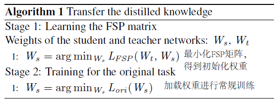

# 模型压缩

## 剪枝

### Pruning Filters for Efficient ConvNets

 ICLR 2017

| 主题   | 描述                                                         |
| ------ | :----------------------------------------------------------- |
| 问题   | 当前修剪后的网络由于不规则的稀疏性，可能无法充分减少卷积层的计算成本。 |
| 创新点 | 1. 提出一步压缩和再训练策略。即基于预训练模型，丢弃对性能影响较小的滤波器，生成更小模型。 2. 加载原参数并重新训练，保持精度的同时有效降低计算量。 |
| 原理   | 1. 对滤波器权值求L1范数。过滤器权重均值越小，则期望的输出特征更弱，以此判断其重要程度。 2. 同阶段的压缩率相同；不同阶段压缩率因压缩敏感而不同。 3. 提出单层、层间、跨多层的滤波器压缩策略。 |
| 好处   | 1. 通用性强 2. 修剪后重新训练，指标接近原网络。          |

### Learning Efficient Convolutional Networks through Network Slimming

ICCV 2017

| 主题   | 描述                                                         |
| ------ | :----------------------------------------------------------- |
| 问题   | 模型部署问题：模型尺寸、内存占用、计算量复杂。               |
| 创新点 | 1. 训练过程中，自动识别大网络的无关通道，迫使通道级稀疏性修剪后得到紧凑的小网络，同时保持精度。 2. 利用BN层尺度因子，未更改模型结构。 |
| 原理   | 1. 对BN层的尺度因子进行L1正则化，趋向于0值为无关通道或神经元。 2. 再进行通道级别修剪，并微调训练来补偿精度。 3. L1稀疏性项 更倾向迫使比例因子接近0。 |
| 好处   | 减少模型尺寸、降低内存、降低计算量                           |

### Filter Pruning via Geometric Median for Deep Convolutional Neural Networks Acceleration

CVPR 2019

| 主题   | 描述                                                         |
| ------ | :----------------------------------------------------------- |
| 问题   | 1. 之前方法的准则是正则值越小，代表重要程度越低。依赖两个理想前提：      （1）过滤器的规范偏差应该较大      （2）过滤器最小范数应该较小 2. 基于规范值压缩可能对网络造成负面影响。 |
| 创新点 | 1.  提出几何均值压缩滤波器FPGM，忽略前提，直接压缩模型。 2.  不同于压缩较少贡献的滤波器，FPGM压缩替代性强的冗余滤波器。 |
| 原理   | 1.  找出卷积层内几何中值对应的过滤器，代表该层的公共信息。 2.  在该层 压缩 与几何中值欧式距离最近的滤波器，压缩造成的性能影响最小。 3.  与压缩再微调不同，本文是训练过程中每轮压缩一次。 |
| 好处   | 1. 无需前提即可压缩。 2. 可与基于规范值压缩算法结合。    |

## 蒸馏

### A Gift from Knowledge Distillation: Fast Optimization, Network Minimization and Transfer Learning

CVPR 2017

| 主题   | 描述                                                         |
| ------ | :----------------------------------------------------------- |
| 问题   | 之前算法让网络根据输入输出，自行推断映射关系。               |
| 创新点 | 1、蒸馏知识定义为层间特征关系，即FSP矩阵。 2、小模型直接学习映射关系，比大模型更易优化、性能更好 |
| 原理   |                                             |
| 好处   | 快速优化、模型压缩、适用迁移学习                             |